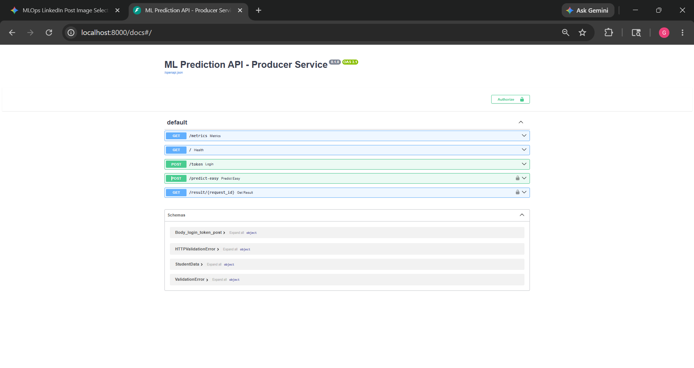

# 🎓 Student Performance Prediction - End-to-End MLOps Platform

## 🚀 Overview

This project is a production-style end-to-end MLOps platform built for predicting student performance using Machine Learning and Kubernetes-native infrastructure.

The project focuses on the complete ML lifecycle including:

* Workflow orchestration
* Automated retraining
* Hyperparameter tuning
* Experiment tracking
* Model deployment
* Monitoring & observability
* Explainability
* Canary deployment
* Kubernetes-based scaling

---

# 🏗️ System Architecture

```text
Dataset
   ↓
Apache Airflow (ETL + Scheduling)
   ↓
Kubeflow Pipelines (Training Workflow)
   ↓
Katib (Hyperparameter Tuning)
   ↓
MLflow (Experiment Tracking)
   ↓
Seldon Core (Model Deployment)
   ↓
FastAPI (Inference API)
   ↓
Prometheus + Grafana (Monitoring)
```

---

# ⚡ Features

## ✅ Machine Learning

* Student performance prediction
* Model training & evaluation
* Scikit-learn integration
* Model serialization using Joblib

## ✅ Workflow Orchestration

* Apache Airflow DAG scheduling
* Automated retraining workflows
* Pipeline automation

## ✅ Kubeflow Pipelines

* Kubeflow DSL components
* Artifacts & metrics tracking
* Conditional deployment
* Pipeline caching
* Scheduled pipelines
* Parallel execution

## ✅ Hyperparameter Tuning

* Katib integration
* Automated parameter optimization
* Learning rate & model tuning

## ✅ Model Deployment

* Seldon Core deployment
* Canary deployment
* A/B testing
* Inference graphs

## ✅ Explainability & Monitoring

* SHAP Explainability (XAI)
* Outlier detection
* Prometheus metrics
* Grafana dashboards
* API monitoring

## ✅ API Engineering

* FastAPI inference endpoints
* Swagger documentation
* JWT authentication

---

# 🛠️ Tech Stack

| Category            | Tools                |
| ------------------- | -------------------- |
| Language            | Python               |
| ML Framework        | Scikit-learn         |
| API                 | FastAPI              |
| Containerization    | Docker               |
| Orchestration       | Kubernetes           |
| Workflow            | Apache Airflow       |
| Pipelines           | Kubeflow             |
| Tuning              | Katib                |
| Deployment          | Seldon Core          |
| Monitoring          | Prometheus + Grafana |
| Experiment Tracking | MLflow               |

---

# 📂 Project Structure

```text
student-feature-repo/
│
├── airflow/
├── kubeflow/
├── monitoring/
├── seldon/
├── api/
├── models/
├── datasets/
├── dashboards/
├── deployment/
└── README.md
```

---

# 📊 Monitoring & Dashboards

The platform includes:

* API latency monitoring
* Request tracking
* Prediction metrics
* Model monitoring
* Resource utilization dashboards

Powered by:

* Prometheus
* Grafana

---

# 🔥 Deployment Features

* Kubernetes deployments
* Canary rollout strategy
* A/B testing
* Auto pipeline scheduling
* Scalable inference serving

---

# 📸 Screenshots


## Grafana Dashboard


## FastAPI Swagger Docs



## Grafana Alerts


---

# 📌 Future Improvements

* CI/CD automation
* Cloud deployment (AWS/GCP/Azure)
* Data drift-triggered retraining
* Advanced model registry
* LLMOps integration

---

# 🎯 Learning Outcome

This project helped in understanding real-world MLOps concepts including:

* End-to-end ML lifecycle management
* Production ML deployment
* Kubernetes-native ML systems
* Monitoring & observability
* Scalable ML infrastructure
* Automated ML workflows
